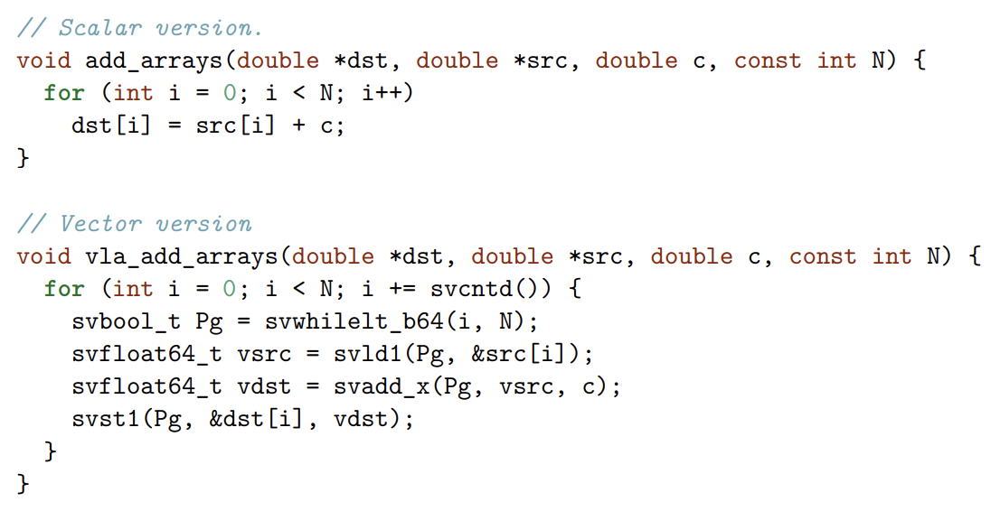

### simd

Direct code gen for NFA/DFA has a lot of advantages:
- speed is good
- memory footprint low

To optimize the matcher, we can use SVE when there are many branches:

```c
mins = svld1(min_table)
s1 = svcmple(mins, c)
maxes = svld1(max_table)
s2 = svcmpge(maxes, c)
si = svand(s1, s2)
// table lookup, in x64 it is pshufb
st = svld1(state_table)
states = svtbl(st, si)
sum_state = svorv(states) // union states together
```



See also: ARM C language extensions for SVE
https://www.stonybrook.edu/commcms/ookami/support/_docs/acle_sve_100987_0000_06_en.pdf 
SVE usage example
https://developer.arm.com/-/media/Arm%20Developer%20Community/PDF/Arm-scalable-vector-extensions-and-application-to-machine-learning.pdf?revision=efbf67e9-af8c-4ba6-a7ad-2a67cce373d2 

LLVM can auto-vectorize the above code now https://llvm.org/docs/Vectorizers.html 
(need a benchmark to check? this direction doesn't work well now)

## accel ideas

maybe we can use simd techniques in regexp matching (another article?)
http://www.cs.columbia.edu/~orestis/damon16.pdf

simd: shift-or matching technique (hyperscan), simdjson also uses techs like this. main idea is: network flow analysis for literal strings and prefilter, use simd shift-or matching.
https://www.usenix.org/conference/nsdi19/presentation/wang-xiang
https://pdfs.semanticscholar.org/1d63/d8ba1420da5042acc74428626086c827557d.pdf
a more portable lib, rust's teddy for regexp matching:
https://github.com/jneem/teddy

a blog for simd in parsing:
https://pdimov.github.io/blog/2020/05/15/its-a-small-world/

table based bit DFA ideas (but it doesn't work with SIMD regexp?)

DFA tricks: bit pop count -- but this method is slow when we want to match 4-8 chars
We can have 26 bits for a..z as pop-count index. and compress out-links.

BitFA: Transitions can be considered as bit matrix multiplying. Memory usage is less than DFA (though still a bit more than NFA) -- N x N x |\Sigma| bits, for a char there is NxN matrix for the state transition
https://dl.acm.org/doi/pdf/10.1145/3123878.3132011
COMMENT: this is not really an innovation. It is equivalent to a normal lookup table with state sets. lookup then OR the sets together.

bitmap DFA compressions summary (focus on compression, software / hardware):
https://telsoc.org/sites/default/files/tja/pdf/125-article_text-1638-2-9-20180924-fixed.pdf

Unicode character class matcher: see https://github.com/katef/libfsm

Another idea is to split unicode char to utf-8 table like in reflex:
http://citeseerx.ist.psu.edu/viewdoc/summary?doi=10.1.1.114.9504

SIMD matrix transpose by bit tricks, may give inspirations.
https://gist.github.com/bzm3r/a888c3f8a3255379941cd7003608e25a

from brzozowski to hopcroft compression
https://m.riunet.upv.es/bitstream/handle/10251/27623/partial%20rev%20determ.pdf

DFA / NFA basis: automata and coinduction
 https://citeseerx.ist.psu.edu/viewdoc/download?doi=10.1.1.221.6957&rep=rep1&type=pdf

enhanced coinduction -> enhanced induction
https://dl.acm.org/doi/abs/10.1145/3498679

regexp as type, bit coding represent parse tree
https://di.ku.dk/kmc/documents/henglein2011.pdf

bit coding tree is first dscribed in
http://www.cse.chalmers.se/~patrikj/poly/dc/
